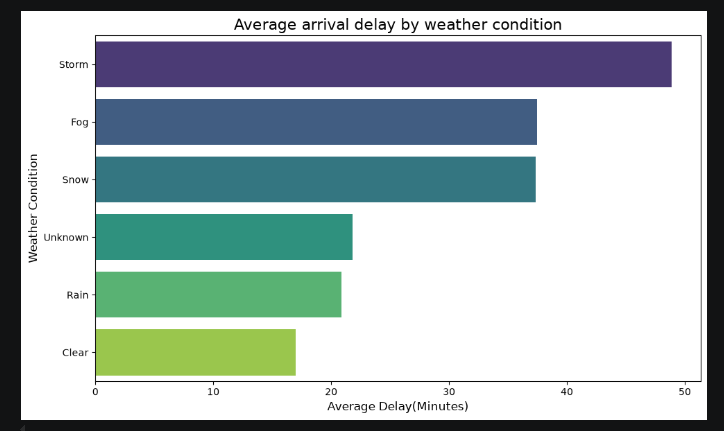
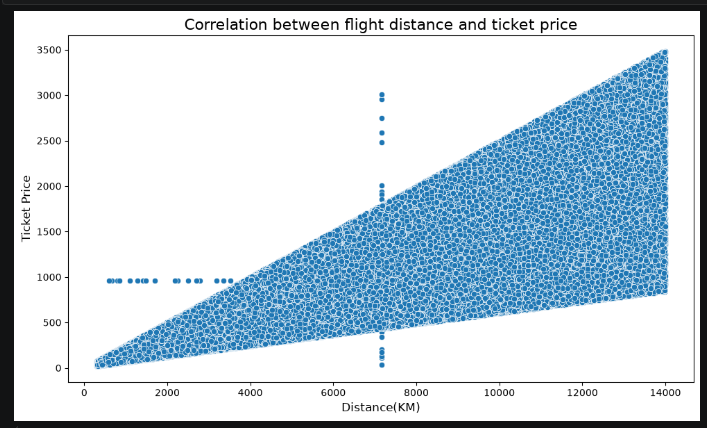
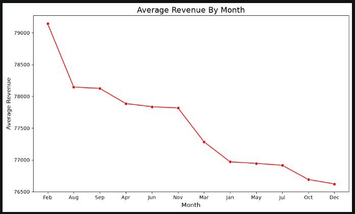
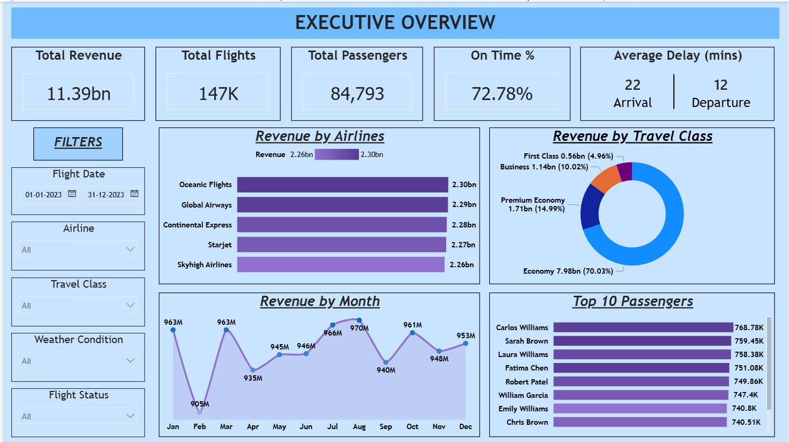
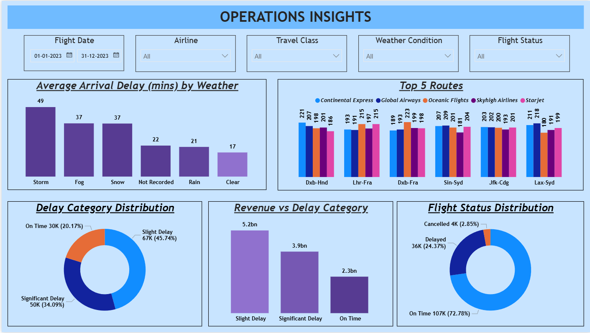
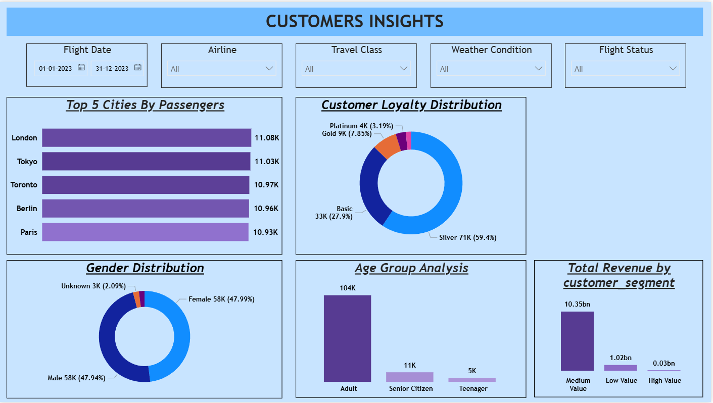

# Airlines Data Analysis
This project demonstrates a complete end-to-end data analytics workflow using a messy airline dataset of year 2023. The objective was to transform raw, inconsistent data into meaningful business insights through data cleaning, exploratory analysis, SQL querying, and interactive Power BI dashboards.

## Problem Statement

The airline industry generates a massive amount of operational and customer data every day. However, raw datasets often contain missing values, duplicates, inconsistent formats, and redundant information, making them unsuitable for analysis.

The objective of this project is to clean and transform the raw airline data into an analysis-ready dataset and answer important business questions such as:

- Which airlines generate the highest revenue?
- Which customers contribute the most revenue?
- How do weather conditions affect flight delays?
- Which travel class contributes the highest revenue?
- Which cities have the largest customer base?
- How do flight delays vary across airlines?
- What are the monthly trends in revenue and flight operations?
- How can customers be segmented based on their spending?

### Steps followed 

- Step 1 : Loaded the raw airline datasets into Python using Pandas.
- Step 2 : Performed following data cleaning steps by:
1. Removing duplicate records
2. Handling missing values
3. Correcting inconsistent data
4. Renaming columns
5. Converting data types
6. Formatting date columns
7. Removing unnecessary columns

- Step 3 : Performed Feature Engineering by creating additional business related columns such as:
1. Flight Month
2. Delay Category
3. Distance Category
4. Total Revenue

- Step 4 : Conducted Exploratory Data Analysis (EDA) using:
1. Pandas
2. Numpy
3. Matplotlib
4. Seaborn

   EDA included:
1. Average arrival delay by weather condition

   
2. Correlation between flight distance and ticket price

   
3. Average revenue by month

   
- Step 5 : Exported the cleaned datasets and imported them into Microsoft SQL Server Management Studio (SSMS). 
- Step 6 : Performed SQL analysis to answer business questions using:
1. Inner join
2. Group by
3. Aggregate Functions
4. Common Table Expressions (CTEs)
5. Case Statements
6. Window Functions
7. DENSE_RANK()
8. Date Functions

Some of the SQL analyses included:
1. Revenue by airline
2. Top 10 busiest flight routes
3. Weather conditions causing highest delays
4. Revenue by travel class
5. Monthly flight trend
6. Higest spending customers
7. Ranking airlines by revenue
8. Highest number of passengers by city
9. Customer segmentation by total spent

- Step 7 : Imported the cleaned SQL data into Power BI Desktop.

- Step 8 : Designed a 3-page interactive dashboard consisting of:

1. 📊 Executive Overview
- Total Revenue
- Total Flights
- Total Passengers
- Revenue by Airline
- Revenue by Travel Class
- Monthly Flight Trend
- Top 10 Passengers

2. ✈️ Operations Dashboard
- Flight Status Distribution
- Average Delay by Weather
- Delay Distribution
- Revenue vs Delay Analysis
- Top 5 Routes
  
3. 👥 Customer Insights
- Passenger Loyalty Distribution
- Passenger Distribution by City
- Gender Distribution
- Age Group Analysis
- Revenue by Customer Segment
  
- Step 9 : Created DAX Measures including:
  1. Average Arrival Delay = AVERAGE('facts_flights'[arrival_delay_minutes])
  2. Average Departure Delay = AVERAGE('facts_flights'[departure_delay_minutes])
  3. On Time % = DIVIDE(CALCULATE(COUNTROWS('facts_flights'),'facts_flights'[flight_status]="On Time"), CALCULATE(COUNTROWS('facts_flights'), ALL('facts_flights'[flight_status])))
  4. Total Customers = COUNTROWS(DISTINCT('dim_passengers'[customer_id]))
  5. Total Flights = DISTINCTCOUNT('facts_flights'[flight_id])
  6. Total Revenue = SUM('facts_flights'[total_revenue])
           
          
- Step 10 : Added interactive slicers for:
  1. Flight Date
  2. Airline
  3. Travel Class
  4. Weather Condition
  5. Flight Status
     
## **Insights**

### [1] Executive Overview
  1. Oceanic Flights generated highest revenue of 2.30 billion.
  2. 70% Passengers preferred Economy class while travelling.
  3. August month has highest revenue (970 million) while February has lowest revenue (905 million).
  4. Carlos Williams is the highest spending passenger (768.78K).

  
  

### [2] Operations Insights
  1. Stormy weather caused highest delays (49 mins).
  2. Most number of flights were operated in Dxb-Hnd route.
  3. Most flights were slightly delayed this year (45.74%) among the flights which were running, although it generated highest revenue (5.2 billion).
  4. 72.78% flights were running, 24.37% flights got delays and 2.85% flights got cancelled.

### [3] Customer Insights
  1. Most passengers preferred travelling to London (11.08k).
  2. Silver loyalty status have highest number of passengers count (71k).
  3. Females passengers were slightly higher compared to male passengers.
  4. Adults passengers travelled the most (104k).
  5. Medium value passengers generated highest revenue (10.35 billion).

  
  
